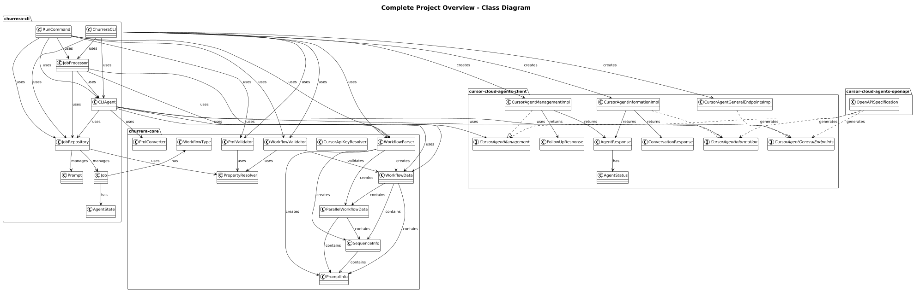
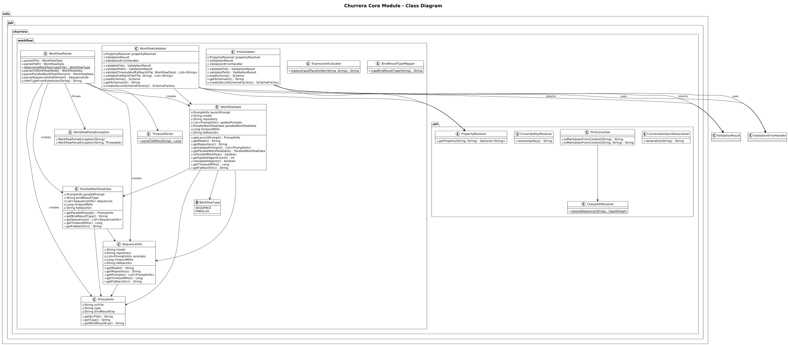
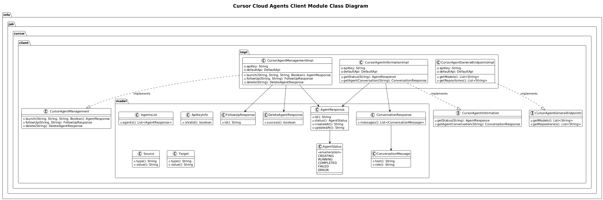
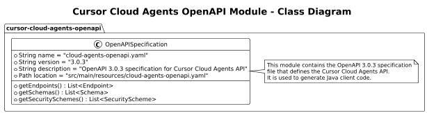
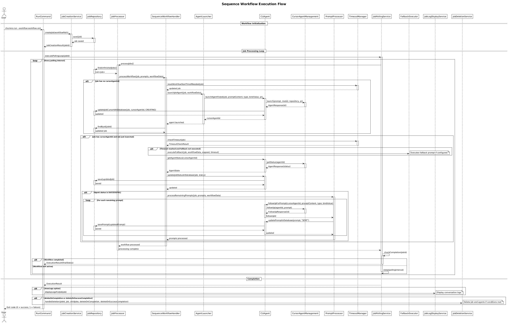

# UML Diagrams

This document contains the continuously generated diagrams for the Churrera project. All PNG diagrams live in this directory, while the PlantUML sources are stored under `puml/`.

## Complete Project Overview

The complete class diagram shows how every module collaborates, highlighting cross-module dependencies between the CLI, core utilities, and Cursor integrations.



## Module Class Diagrams

### Churrera CLI

The CLI module orchestrates user commands, job lifecycle management, and workflow execution handlers.


- `ChurreraCLI` wires configuration, repositories, and agents.
- `RunCommand` manages job creation, polling, and cleanup.
- `JobProcessor` delegates to workflow handlers (`Sequence`, `Parallel`, `Child`) through `AgentLauncher`, `PromptProcessor`, `TimeoutManager`, `FallbackExecutor`, and `ResultExtractor`.
- `JobRepository` persists `Job`, `Prompt`, and `JobWithDetails` records.

### Churrera Core

Core utilities parse workflows, validate PML files, and expose shared data structures for the CLI.



- `WorkflowParser` builds `WorkflowData`, `ParallelWorkflowData`, `SequenceInfo`, and `PromptInfo`.
- `WorkflowValidator` and `PmlValidator` enforce schema rules.
- Utilities such as `PmlConverter`, `PropertyResolver`, `CursorApiKeyResolver`, `TimeoutParser`, `ExpressionEvaluator`, and `BindResultTypeMapper` provide supporting logic.

### Cursor Cloud Agents Client

This module encapsulates Cursor API interactions with typed interfaces, implementations, and data models.



- Interfaces: `CursorAgentManagement`, `CursorAgentInformation`, `CursorAgentGeneralEndpoints`.
- Implementations: `CursorAgentManagementImpl`, `CursorAgentInformationImpl`, `CursorAgentGeneralEndpointsImpl`.
- Models: `AgentResponse`, `AgentStatus`, `ConversationResponse`, `ConversationMessage`, `AgentsList`, `Source`, `Target`, `DeleteAgentResponse`, `FollowUpResponse`.

### Cursor Cloud Agents OpenAPI

This module tracks the authoritative OpenAPI specification used to generate the Cursor client.



- Diagram summarizes the top-level OpenAPI document (`cloud-agents-openapi.yaml`) with metadata, paths, components, and security requirements.

## Workflow Sequence Diagrams

### Sequence Workflow Execution

Illustrates the blocking CLI run command processing a sequential workflow from job creation through prompt execution and status monitoring.



Key phases:
- User invokes `RunCommand`.
- `JobCreationService` persists the job.
- `JobProcessor` and `SequenceWorkflowHandler` launch the agent, monitor status via `CLIAgent`, and process follow-up prompts with `PromptProcessor`, `TimeoutManager`, and `FallbackExecutor`.

### Parallel Workflow Execution

Shows how a parent parallel workflow produces child jobs that run their own sequences after result extraction.


Key phases:
- Parent job launches through `ParallelWorkflowHandler`.
- `ResultExtractor` parses agent responses to generate child jobs.
- Each child job executes via `ChildWorkflowHandler`, `AgentLauncher`, and `PromptProcessor`, with timeout/fallback safeguards.

---

To regenerate the PNGs automatically:

```bash
jbang puml-to-png@jabrena --watch ./documentation/uml/
```

Source `.puml` files are kept in `puml/` while the rendered `.png` images remain in this directory for documentation consumption.
